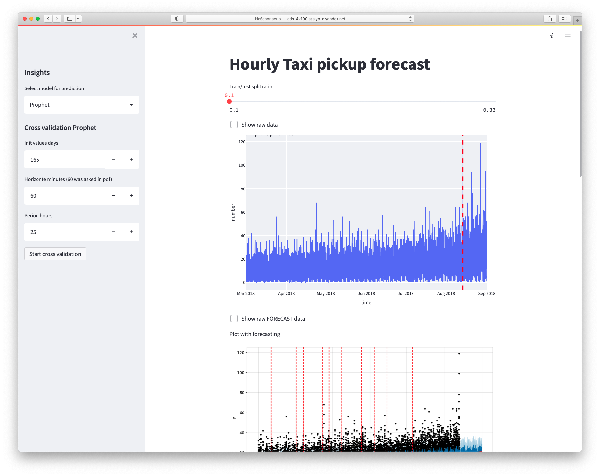

# OneDayTimeSeriesForecastTask

End2End timeseries interview-like forecasting task using Python: Prophet + Streamlit (UI+Backend)


- `eda.ipynb` - notebook with analysis and model comparing
- `demo.py` - streamlit application

## Commands to start an application

```bash
streamlit run --server.port 9333 --server.address 0.0.0.0 demo.py

streamlit run --server.port 9333 --browser.serverAddress 51.250.23.232 demo.py
```

```bash
pip install --force-reinstall -r requirements.txt
```

```bash
pipreqs --force .
```

## Comments

- Provided Docker image with required library
-
